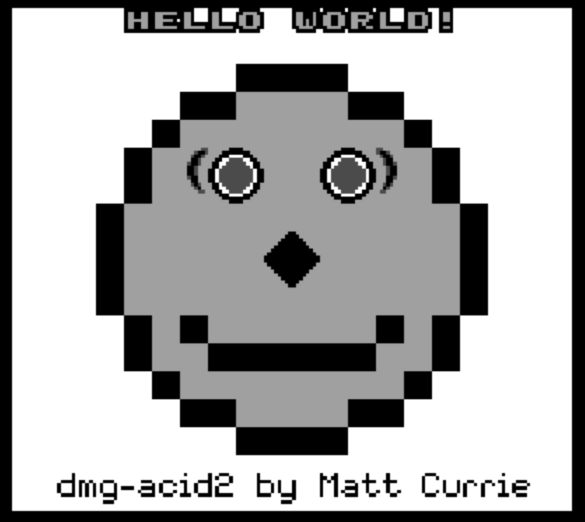
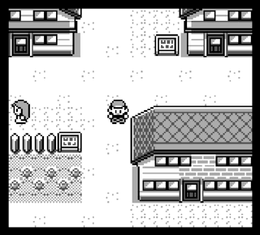
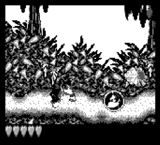
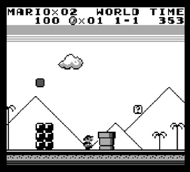
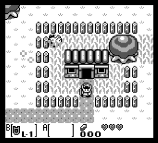
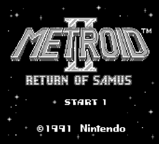
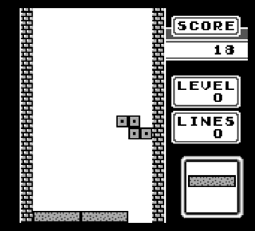
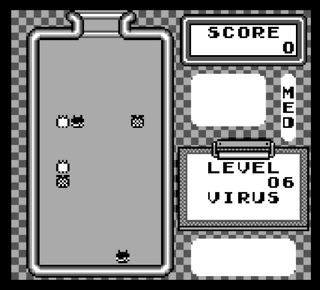

# stoicgb

A Game Boy emulator written in C++ to develop a better understanding of how certain machines work together in a 
precisely synchronized fashion in order to keep a gaming addict like myself addicted. 

It's not the most accurate emulator out there, but it's accurate enough to play some of the games I grew up with,
such as my beloved Pokémon Yellow.

## Usage
Tested on MacOS so far.
### Dependencies
`cmake`, `SDL2`, `SDL2_ttf`, `tinyfiledialogs` (included in repo)

TODO: My CMakeLists.txt is not the most sophisticated in finding SDL2. I'll work on that.
For now, we have to manually set the paths to SDL2_ttf.

### Building
```bash
cmake . 
```

### Running
```bash
./stoicgb          Opens a file dialog for selecting a standard Game Boy ROM
```

## Features
- Accurate CPU with correct opcode implementations and timings. It is the CPU, at least in my implementation, that is 
  central to synchronizing all components.
- PPU (whose timings are accurate enough to render many games).
- Working stereo audio using `SDL_QueueAudio` (again, timings are accurate enough for many games).
- Memory Bank Controllers: MBC0 (no MBC), MBC1, MBC2, MBC3, MBC5 (no RTC support) .
- Battery for saving (via external RAM dumps).
- Loading of save files (automatically attempts to load from the same directory as a battery-supported ROM).
- Disassembler (for debugging).

I still have a lot of work to do in terms of accuracy, and I also plan on adding more features, but I'm happy with the 
progress I've made so far. 

## Controls
|       Key        | Action |
|:----------------:|:------:|
| <kbd>Enter</kbd> | Start  |
| <kbd>Space</kbd> | Select |
|   <kbd>↑</kbd>   |   Up   |
|   <kbd>↓</kbd>   |  Down  |
|   <kbd>←</kbd>   |  Left  |
|   <kbd>→</kbd>   | Right  |
|   <kbd>Z</kbd>   |   A    |
|   <kbd>X</kbd>   |   B    |
|  <kbd>esc</kbd>  |  Quit  |

## Tests 
<table>
<tr>
<td>

### Blargg's
|      Test      |    Result    |
|:--------------:|:------------:|
|   cpu_instrs   |      ✅       |
|  instr_timing  |      ✅       |
| interrupt_time | ✅ (DMG only) |
|   mem_timing   |      ✅       |
|  mem_timing-2  |      ✅       |
|   dmg_sound    |      ❌       |
|    oam_bug     |      ❌       |
|    halt_bug    |      ❌       |

</td>
<td>

### Gekkio's Mooneye
|    Test    | Result | 
|:----------:|:-----:|
|    bits    |   ✅   |
|   instr    |   ✅   |
| interrupts |   ✅   |
|  oam_dma   |   ❌   |
|    ppu     |   ❌   |
|   timer    |   ✅   |

TODO: 

List all the tests.

Many pass. Alas, much fail.


</td>

<td colspan="2" style="text-align: center;">

### Matt Currie's dmg-acid2 ✅
<div style="text-align: center;">
    
</div>

</td>
</tr>
</table>

## Game GIFs
|                                                |                                   |
|:----------------------------------------------:|:---------------------------------:|
|                    |      | 
|                *Pokémon Yellow*                |   *Pokémon Yellow (yes, again)*   |
|                     |  | 
|               *Donkey Kong Land*               |        *Super Mario Land*         |
|  |   | 
|    *The Legend of Zelda: Link's Awakening*     |   *Metroid II: Return of Samus*   |
|                  |   |
|                    *Tetris*                    |            *Dr. Mario*            |


## Resources
I'm grateful to those who have made Game Boy documentations available to the public. I've learned a lot from 
them, and I could not have made this emulator without them. Here is a non-exhaustive list roughly categorized by 
topic of some of the resources I used:

### CPU
- [izik1's gbops, an accurate opcode table for the Game Boy](https://izik1.github.io/gbops/index.html)
- [gekkio's Game Boy: Complete Technical Reference](https://gekkio.fi/files/gb-docs/gbctr.pdf)
- [Sharp Microcomputer Databook](http://bitsavers.trailing-edge.com/components/sharp/_dataBooks/1996_Sharp_Microcomputer_Data_Book.pdf) (p. 140)

### PPU
- [hacktix's GBEDG: The Gameboy Emulator Development Guide](https://hacktix.github.io/GBEDG/ppu/)
- [Low Level Devel's Gameboy Emulator Development Tutorial Series](https://www.youtube.com/playlist?list=PLVxiWMqQvhg_yk4qy2cSC3457wZJga_e5)

### APU
- [NightShade's Game Boy Sound Emulation](https://nightshade256.github.io/2021/03/27/gb-sound-emulation.html)
- [gbdev's Gameboy sound hardware](https://gbdev.gg8.se/wiki/articles/Gameboy_sound_hardware)
- [A Reddit comment by the creator of GhostBoy](https://www.reddit.com/r/EmuDev/comments/5gkwi5/comment/dat3zni/)

### Timings 
- [AntonioND's The Cycle-Accurate Game Boy Docs](https://github.com/AntonioND/giibiiadvance/blob/master/docs/TCAGBD.pdf)

and, of course, [Pan Docs](https://gbdev.io/pandocs/).
